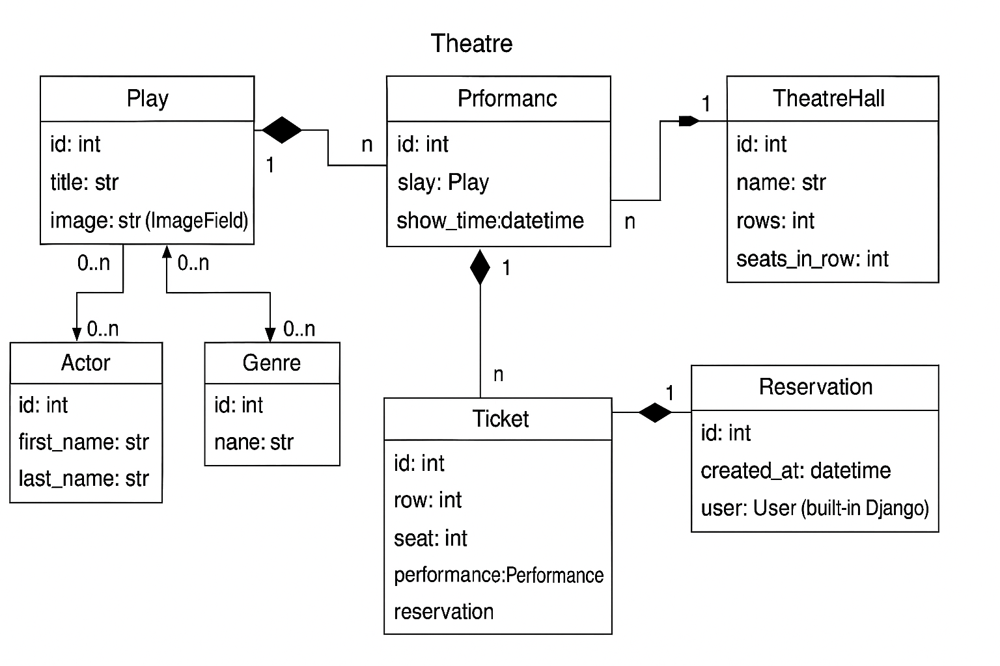

# 🎭 Theatre Service API

A **RESTful API** for managing a theatre system, built with **Django** and **Django REST Framework (DRF)**.  
It provides functionality for managing plays, actors, genres, theatre halls, performances, ticket reservations, and users with JWT authentication.  
The project is containerized with **Docker** and uses **PostgreSQL** as the database.  

---
## Database Schema

The following ER diagram illustrates the data structure and relationships between the models in this project:




## 🚀 Features

- 🎬 Manage **Plays** with descriptions, images, genres, and actors  
- 🎭 Manage **Actors** and **Genres**  
- 🏟 Manage **Theatre Halls** (rows, seats)  
- 📅 Manage **Performances** (schedules linked to plays and halls)  
- 🎟 Ticket booking system with **seat-level reservations**  
- 👤 User management with **JWT authentication**  
- 📂 Media upload for play images  
- 📖 Interactive API documentation via **Swagger & Redoc**  

---

## ⚙️ Installation & Setup

### 1. Clone repository
```bash
git clone <your-repo-url>
cd theatre-service-api
2. Create .env file
At the project root, create .env:

ini
Копировать код
SECRET_KEY=your-django-secret-key
DEBUG=1
DB_NAME=postgres
DB_USER=postgres
DB_PASSWORD=root
DB_HOST=db
DB_PORT=5432
DATABASE_URL=postgres://postgres:root@db:5432/postgres
⚠️ For production, make sure to change these values to secure ones.

3. Build and start Docker containers
bash
Копировать код
docker-compose up --build
4. Apply migrations and load initial data
bash
Копировать код
docker-compose exec web python manage.py migrate
docker-compose exec web python manage.py loaddata Theatre/fixtures/initial_data.json
🗄 Database Schema
Main entities:

Play → linked with Actors and Genres

TheatreHall → contains rows and seats

Performance → connects a Play with a TheatreHall and show time

Reservation → linked to a user and tickets

Ticket → reserved seat for a performance

🎭 API Endpoints
Base URL (local):

cpp
Копировать код
http://127.0.0.1:8000/
🔑 User Authentication
Method	Endpoint	Description
POST	/api/user/register/	Register new user
POST	/api/user/token/	Get JWT access/refresh tokens
POST	/api/user/token/refresh/	Refresh JWT token
POST	/api/user/token/verify/	Verify JWT token
GET	/api/user/me/	Get current authenticated user

Example login request:

json
Копировать код
POST /api/user/token/
{
  "email": "user@example.com",
  "password": "yourpassword"
}
Headers for authenticated requests:

makefile
Копировать код
Authorization: Bearer <your_access_token>
🎬 Theatre API
Method	Endpoint	Description
GET	/api/theatre/plays/	List all plays
POST	/api/theatre/plays/	Create a new play
GET	/api/theatre/plays/{id}/	Retrieve play details
GET	/api/theatre/actors/	List actors
GET	/api/theatre/genres/	List genres
GET	/api/theatre/theatre-halls/	List theatre halls
GET	/api/theatre/performances/	List performances
POST	/api/theatre/performances/	Create performance (admin only)
GET	/api/theatre/reservations/	View reservations of current user
POST	/api/theatre/reservations/	Create reservation
GET	/api/theatre/tickets/	List tickets

📖 API Documentation
Interactive docs are available once the server is running:

Swagger UI → http://127.0.0.1:8000/api/schema/swagger/

Redoc → http://127.0.0.1:8000/api/schema/redoc/

🧪 Running Tests
Run tests with pytest inside Docker:

bash
Копировать код
docker-compose exec web pytest
🛠 Technologies Used
Python 3.11

Django 5.x

Django REST Framework (DRF)

SimpleJWT (JWT authentication)

drf-spectacular (API documentation)

PostgreSQL

Docker & Docker Compose

Pytest

Debug Toolbar

📌 Notes
Default page size for list endpoints = 10 (pagination enabled).

Rate limiting enabled: 10000/day for authenticated users, 300/day for anonymous users.

Media files are served from /media/.